# Secret Broadcasting and Redemption Functions

## 📍 **Function Locations Summary**

### 🔵 **Ethereum Chain Functions**

#### 1. **Secret Broadcasting Function**

**📁 Location**: `/my-solidity-project/contracts/HTLC.sol`
```solidity
function revealSecret(bytes32 lockId, string calldata secret) external {
    require(isLocked[lockId], "Lock does not exist");
    require(
        keccak256(bytes(secret)) == lockData[lockId].secretHash,
        "Invalid secret"
    );

    emit SecretRevealed(lockId, secret);
}
```

**📁 JavaScript Wrapper**: `/my-solidity-project/localhost-script/htlc/revealSecret.js`
```javascript
// Key function call:
const tx = await htlc.connect(signer).revealSecret(h.lockId, h.secret);
await tx.wait();
console.log(`Secret broadcasted: ${h.secret}`);
```

#### 2. **ETH Redemption Function** 

**📁 Location**: `/my-solidity-project/contracts/HTLC.sol`
```solidity
function withdraw(bytes32 id, bytes calldata secret) external {
    require(isLocked[id], "Lock does not exist");
    LockData memory data = lockData[id];

    require(keccak256(secret) == data.secretHash, "Invalid secret");

    isLocked[id] = false;
    delete lockData[id];

    (bool sent, ) = data.recipient.call{value: data.amount}("");
    require(sent, "ETH transfer failed");

    emit Withdrawn(id, data.recipient, secret);
}
```

**📁 JavaScript Wrapper**: `/my-solidity-project/localhost-script/htlc/withdrawHTLC.js`
```javascript
// Key function calls:
async function fetchSecret(lockId) {
    const eventFilter = htlc.filters.SecretRevealed(lockId);
    const revealedEvents = await htlc.queryFilter(eventFilter);
    if (revealedEvents.length === 0) {
        throw new Error(`Secret not yet revealed for lockId: ${lockId}`);
    }
    return revealedEvents[0].args.secret;
}

const calldata = htlc.interface.encodeFunctionData("withdraw", [
    lockId,
    hre.ethers.toUtf8Bytes(secret),
]);
```

### 🟠 **Bitcoin Chain Functions**

#### 3. **Bitcoin HTLC Redemption Function**

**📁 Location**: `/bitcoin-chain/src/htlc/sign-redeem/sign_redeem_transaction.go`
```go
func signTransaction(input InputSignRedeemTransaction, netParams *chaincfg.Params) (string, error) {
    // Extract preimage hash from redeem script
    expectedHashBytes, err := extractPreimageHash(redeemScriptBytes)
    if err != nil {
        return "", fmt.Errorf("error extracting preimage hash: %v", err)
    }

    // Verify preimage hash
    hash := sha256.Sum256([]byte(input.mySecret))
    if !bytes.Equal(hash[:], expectedHashBytes) {
        return "", fmt.Errorf("preimage hash does not match")
    }

    // Sign with secret and private key
    signature := ecdsa.Sign(privKey, sighash)
    sigWithHashType := append(signature.Serialize(), byte(txscript.SigHashAll))

    // Construct scriptSig for P2SH (HTLC success path)
    scriptSig, err := txscript.NewScriptBuilder().
        AddData(sigWithHashType).           // Signature
        AddData([]byte(input.mySecret)).    // Secret preimage
        AddData([]byte{1}).                 // OP_TRUE for success path
        AddData(redeemScriptBytes).         // Redeem script
        Script()

    // Broadcast using bitcoin-cli
    cmd := exec.Command("bitcoin-cli", "sendrawtransaction", hex.EncodeToString(signedTx.Bytes()))
    output, err := cmd.CombinedOutput()
    if err != nil {
        return "", fmt.Errorf("failed to broadcast transaction: %v", err)
    }
    
    return hex.EncodeToString(signedTx.Bytes()), nil
}
```

**📁 Main Execution**: `/bitcoin-chain/src/htlc/sign-redeem/main.go`
```go
func main() {
    // Read secret from exchange data
    secret, err := readSecretPreimage()
    if err != nil {
        fmt.Printf("Error reading secret from exchange data: %v\n", err)
        return
    }

    // Sign and broadcast transaction with secret
    signedTxHex, err := signTransaction(signInput, netParams)
    if err != nil {
        fmt.Printf("Error signing transaction: %v\n", err)
        return
    }

    fmt.Println("Signed transaction hex:", signedTxHex)
}
```

## 🔄 **Execution Flow**

### **Phase 1: Secret Broadcasting (Ethereum)**
```bash
# Execute via eth-script-2.txt
npx hardhat run localhost-script/htlc/revealSecret.js --network localhost
```

**What happens:**
1. Reads secret from `exchange-data.json`
2. Validates secret hash matches HTLC
3. Calls `revealSecret(lockId, secret)` on HTLC contract
4. Emits `SecretRevealed(lockId, secret)` event

### **Phase 2: ETH Redemption (Ethereum)**
```bash
# Execute via eth-script-2.txt  
npx hardhat run localhost-script/htlc/withdrawHTLC.js --network localhost
```

**What happens:**
1. Listens for `SecretRevealed` events
2. Extracts secret from event data
3. Calls `withdraw(lockId, secret)` via multisig
4. Transfers ETH to recipient

### **Phase 3: Bitcoin Redemption (Bitcoin)**
```bash
# Execute via btc-script.txt
cd ../sign-redeem
go run *.go
```

**What happens:**
1. Reads secret from `exchange-data.json`
2. Signs redeem transaction with secret + private key
3. Constructs scriptSig with secret preimage
4. Broadcasts transaction via `bitcoin-cli sendrawtransaction`

## 🔗 **Cross-Chain Coordination**

### **Data Flow:**
```
1. createHTLC.js → generates secret → exchange-data.json
2. revealSecret.js → broadcasts secret → SecretRevealed event
3. withdrawHTLC.js → listens for event → redeems ETH
4. sign-redeem/main.go → reads secret → redeems BTC
```

### **Key Files for Coordination:**
- **`exchange-data.json`**: Contains shared secret and HTLC metadata
- **`SecretRevealed` event**: On-chain secret broadcast mechanism
- **HTLC contracts**: Both chains use same secret hash

## ⚡ **Key Security Features**

1. **Hash Verification**: Both chains verify secret matches hash
2. **Atomic Execution**: Either both redeem or both timeout
3. **Timelock Protection**: Refund mechanisms on both chains
4. **Multi-signature**: ETH redemption requires multisig approval

## 🎯 **Function Call Summary**

| Chain | Function | Purpose | Location |
|-------|----------|---------|----------|
| **Ethereum** | `revealSecret()` | Broadcast secret on-chain | `HTLC.sol:109` |
| **Ethereum** | `withdraw()` | Redeem ETH with secret | `HTLC.sol:71` |
| **Bitcoin** | `signTransaction()` | Sign & broadcast BTC redemption | `sign_redeem_transaction.go:59` |
| **Cross-chain** | `fetchSecret()` | Listen for revealed secrets | `withdrawHTLC.js:44` |

## ⚠️ **What Happens If Wrong Secret Is Revealed?**

### 🔒 **Security Mechanisms & Failure Points**

Your implementation has multiple layers of protection against wrong secrets:

#### **1. Pre-broadcast Validation (JavaScript)**
**📁 Location**: `revealSecret.js:33-37`
```javascript
const actualSha256 = crypto.createHash("sha256").update(h.secret).digest("hex");
if (actualSha256 !== h.hashSha256) {
    throw new Error("Secret mismatch. The secret in exchange-data.json is invalid.");
}
```
**Result**: ❌ **Script fails before reaching blockchain** - No gas wasted

#### **2. Ethereum Smart Contract Validation** 
**📁 Location**: `HTLC.sol:109-116`
```solidity
function revealSecret(bytes32 lockId, string calldata secret) external {
    require(isLocked[lockId], "Lock does not exist");
    require(
        keccak256(bytes(secret)) == lockData[lockId].secretHash,
        "Invalid secret"  // ← FAILS HERE with wrong secret
    );
    emit SecretRevealed(lockId, secret);
}
```
**Result**: ❌ **Transaction reverts** - Costs gas but secret not revealed

#### **3. Ethereum Withdrawal Validation**
**📁 Location**: `HTLC.sol:71-83` 
```solidity
function withdraw(bytes32 id, bytes calldata secret) external {
    require(isLocked[id], "Lock does not exist");
    LockData memory data = lockData[id];
    require(keccak256(secret) == data.secretHash, "Invalid secret"); // ← FAILS HERE
    // ... rest of withdrawal logic
}
```
**Result**: ❌ **Transaction reverts** - No ETH transferred

#### **4. Bitcoin Script Validation**
**📁 Location**: `sign_redeem_transaction.go:89-94`
```go
// Verify preimage hash
hash := sha256.Sum256([]byte(input.mySecret))
if !bytes.Equal(hash[:], expectedHashBytes) {
    return "", fmt.Errorf("preimage hash %s does not match expected hash %s", hashHex, expectedHashHex)
}
```
**Result**: ❌ **Go program fails** - No Bitcoin transaction broadcast

#### **5. Bitcoin HTLC Script Validation** 
**📁 Location**: `createHTLCcontract.go:56-61`
```go
// Bitcoin script structure:
// IF 
//   SHA256 <hash> EQUALVERIFY <receiverPubKey> CHECKSIG
// ELSE 
//   <locktime> CHECKLOCKTIMEVERIFY DROP <senderPubKey> CHECKSIG
// ENDIF
```
**Result**: ❌ **Script evaluation fails** - Transaction rejected by network

### 🎯 **Attack Scenarios & Outcomes**

| **Attack Scenario** | **What Happens** | **Impact** |
|---------------------|------------------|------------|
| **Wrong secret in revealSecret.js** | JavaScript validation fails | ❌ No transaction sent |
| **Bypass validation, call revealSecret()** | Smart contract reverts | ❌ Gas wasted, no secret revealed |
| **Call withdraw() with wrong secret** | Smart contract reverts | ❌ Gas wasted, no ETH transferred |
| **Bitcoin redemption with wrong secret** | Go program fails or Bitcoin script fails | ❌ No BTC transaction |
| **Modified exchange-data.json** | Multiple validation layers catch it | ❌ All operations fail safely |

### 🛡️ **Multi-Layer Protection Summary**

```mermaid
flowchart TD
    A[Attacker tries wrong secret] --> B{JavaScript Validation}
    B -->|Fails| C[❌ Script terminates]
    B -->|Bypassed| D{Ethereum Smart Contract}
    D -->|Fails| E[❌ Transaction reverts]
    D -->|Bypassed somehow| F{Bitcoin Go Validation}
    F -->|Fails| G[❌ Program terminates]
    F -->|Bypassed| H{Bitcoin Script Validation}
    H -->|Fails| I[❌ Network rejects transaction]
    H -->|Passes| J[✅ Valid secret - Success]
    
    style C fill:#ffebee
    style E fill:#ffebee
    style G fill:#ffebee
    style I fill:#ffebee
    style J fill:#e8f5e8
```



### ⚡ **Key Security Guarantees**

1. **Atomic Protection**: Wrong secret fails on ALL chains simultaneously
2. **Gas Protection**: Multiple validation layers minimize wasted gas
3. **No Partial Execution**: Impossible to redeem on one chain with wrong secret
4. **Hash Consistency**: Same secret hash used across both chains
5. **Script-level Validation**: Even if software is bypassed, blockchain protocols enforce correctness

### 🚨 **Worst Case Scenario**
Even in the most sophisticated attack:
- **ETH remains locked** in HTLC contract
- **BTC remains locked** in HTLC script  
- **Legitimate parties can still refund** after timelock expires
- **No funds are lost** due to timelock safety mechanisms

### ✅ **Conclusion**
**Your implementation is HIGHLY SECURE against wrong secret attacks** through multiple validation layers at different levels of the stack.
