# Intent-centric DEX Workflow Diagram

```mermaid
flowchart TD
    %% Phase 1: Ethereum Setup (eth-script.txt)
    subgraph "Phase 1: Ethereum Setup"
        A1[Deploy IntentMatching Contract] --> A2[Deploy MultisigWallet Contract]
        A2 --> A3[Create BuyIntent<br/>User wants to sell BTC for ETH]
        A3 --> A4[Create SellIntent<br/>Liquidity provider offers ETH for BTC]
        A4 --> A5[Confirm SellIntent<br/>Multisig approval]
        A5 --> A6[View All Intents<br/>Check created intents]
        A6 --> A7[Match BuyIntent ID=0<br/>Execute matching algorithm]
        A7 --> A8[Confirm Multisig Transaction<br/>Approve matched trade]
        A8 --> A9[Deploy HTLC Contract<br/>For atomic swaps]
        A9 --> A10[Fund HTLC Contract<br/>Add ETH liquidity]
        A10 --> A11[Create HTLCs for Matched Trades<br/>Lock ETH with secret hash]
        A11 --> A12[View All HTLCs<br/>Verify HTLC creation]
    end

    %% Transition to Bitcoin
    A12 --> B1
    
    %% Phase 2: Bitcoin Operations (btc-script.txt)
    subgraph "Phase 2: Bitcoin Operations"
        B1[Start Bitcoin Chain<br/>Initialize tmux sessions] --> B2[Initialize Payment Channel<br/>Generate Alice & Bob keys]
        B2 --> B3[Fund Bitcoin Wallets<br/>Mine blocks and distribute BTC]
        B3 --> B4[Generate Payment Message<br/>Create secret and OP_RETURN data]
        B4 --> B5[Verify OP_RETURN Content<br/>Check signature and message]
        B5 --> B6[Create Bitcoin HTLC Contract<br/>P2SH address with timelock]
        B6 --> B7[Fund Bitcoin HTLC<br/>Send BTC to HTLC address]
        B7 --> B8[Wait for Mining<br/>10 minutes for confirmation]
        B8 --> B9[Scan HTLC Address<br/>Collect UTXO data]
        B9 --> B10[Create Redeem Transaction<br/>Prepare to claim HTLC]
        B10 --> B11[Sign Redeem Transaction<br/>With secret and private key]
    end

    %% Transition to final Ethereum phase
    B11 --> C1

    %% Phase 3: Ethereum Completion (eth-script-2.txt)
    subgraph "Phase 3: Ethereum Completion"
        C1[Reveal Secret On-Chain<br/>Broadcast secret via HTLC contract] --> C2[Claim ETH Using Revealed Secret<br/>Withdraw via multisig]
        C2 --> C3[Process Complete<br/>Cross-chain swap successful]
    end

    %% Styling
    classDef ethereumPhase fill:#e1f5fe,stroke:#0277bd,stroke-width:2px
    classDef bitcoinPhase fill:#fff3e0,stroke:#f57c00,stroke-width:2px
    classDef finalPhase fill:#e8f5e8,stroke:#2e7d32,stroke-width:2px
    
    class A1,A2,A3,A4,A5,A6,A7,A8,A9,A10,A11,A12 ethereumPhase
    class B1,B2,B3,B4,B5,B6,B7,B8,B9,B10,B11 bitcoinPhase
    class C1,C2,C3 finalPhase
```

## Workflow Summary

### Phase 1: Ethereum Setup (eth-script.txt)
1. **Contract Deployment**: Deploy core smart contracts (IntentMatching, MultisigWallet, HTLC)
2. **Intent Creation**: Users create buy/sell intents for cross-chain trading
3. **Intent Matching**: Algorithm matches compatible intents
4. **HTLC Preparation**: Lock ETH with secret hash for atomic swap

### Phase 2: Bitcoin Operations (btc-script.txt)
1. **Bitcoin Infrastructure**: Initialize payment channels and fund wallets
2. **Message Generation**: Create payment messages with secrets and OP_RETURN data
3. **Bitcoin HTLC**: Create and fund Bitcoin HTLC contract with matching secret hash
4. **Transaction Preparation**: Prepare redemption transaction with secret

### Phase 3: Ethereum Completion (eth-script-2.txt)
1. **Secret Revelation**: Broadcast the secret on-chain via Ethereum HTLC
2. **Cross-chain Claim**: Use revealed secret to claim ETH via multisig
3. **Atomic Swap Complete**: Both parties receive their intended assets

## Key Features
- **Atomic Swaps**: Ensures both parties get their assets or neither does
- **Intent-based Matching**: Users express intentions rather than direct orders
- **Multi-signature Security**: Critical operations require consensus
- **Cross-chain Coordination**: Secure communication between Bitcoin and Ethereum
